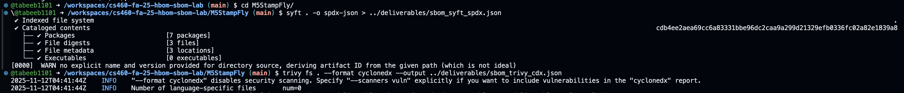
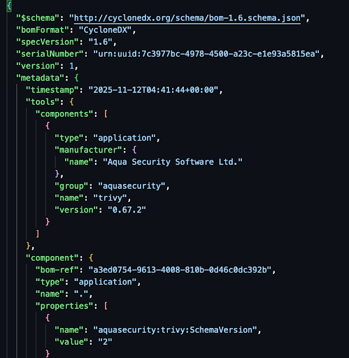
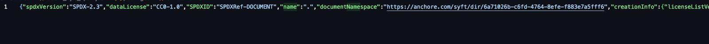

Part 1

Syft found 7 components:

- actions/checkout (v2)
- actions/checkout (v3)
- actions/checkout (v3.1.0)
- actions/cache
- actions/setup-python
- arduino/arduino-lint-action
- jidicula/clang-format-action

Trivy found 0 components.

There was a big difference in the formatting, syft was inconveniently all one line. Trivy instead used man lines and spacing to be readable. I have included pictures of this below.

Part 2

I think the grype report had 0 findings because it relies on known CVEs. Since the syft report only had github actions and the truvy report was empty, this make sense. I also assume that the dependencies of the m5stamp fly code base were not located in the standard places that grype would check.

| CVE | Severity | Component | Version | Comment |
| --- | --- | --- | --- | --- |
| n/a | n/a | n/a | n/a | n/a |
| --- | --- | --- | --- | --- |
| n/a | n/a | n/a | n/a | n/a |
| --- | --- | --- | --- | --- |
| n/a | n/a | n/a | n/a | n/a |
| --- | --- | --- | --- | --- |
| n/a | n/a | n/a | n/a | n/a |
| --- | --- | --- | --- | --- |
| n/a | n/a | n/a | n/a | n/a |
| --- | --- | --- | --- | --- |
